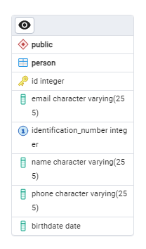

# Java CRUD

Esta es una aplicación de backend construida con **Java** y **Spring Boot**, con una conexión a una base de datos en **PostgreSQL**.

Consiste en crear una tabla en la BBDD y ejecutar las operaciones CRUD básicas para que luego sea consumida por una [aplicación web](https://github.com/miklegonza/crud-frontend) hecha con **Angular**.

## Requerimientos

- Java 22
- PostgreSQL

## Script SQL

La aplicación por si sola crea la tabla en la base de datos cuando se ejecuta y se logra conectar al servidor. Sin embargo, esta es la estructura de la tabla:

```sql
CREATE TABLE IF NOT EXISTS public.person (
    id integer NOT NULL,
    email character varying(255) NOT NULL,
    identification_number integer NOT NULL,
    name character varying(255) NOT NULL,
    phone character varying(255) NOT NULL,
    birthdate date NOT NULL,
    CONSTRAINT person_pkey PRIMARY KEY (id),
    CONSTRAINT person_uq UNIQUE (identification_number)
);
```

## Diagrama ERD



## API Reference

🚀 [Reference](./REFERENCE.http)

## Frontend

✨ [Proyecto Angular](https://github.com/miklegonza/crud-frontend)
